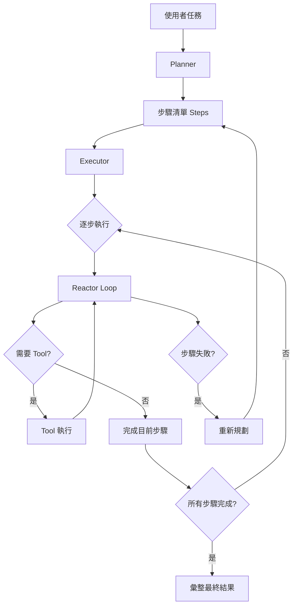

# 02-AI Agent 架構：Plan and Execute

## 摘要

[Plan and Execute](Plan%20and%20Execute) Agent 的核心方式是：先由 LLM 將任務拆成多個具體步驟，再逐步執行。每個步驟的執行可以重複使用 [Reactor Agent](Reactor%20Agent) 的工具呼叫與反應迴圈；若執行失敗，外層流程還能觸發重新規劃。影片以「計算 21 + 21，並統計結果字串的字元數」示範完整流程。〔00:00:00–00:18:52〕

> [!note] 影片內容
> Plan and Execute 可以理解為「外層負責計畫，內層負責反應式執行」：Plan 負責拆解任務，Execute 負責逐步完成，每一步又可能嵌套 Reactor Loop。〔00:00:00–00:03:20〕

## 為什麼需要 Plan and Execute？

Reactor Agent 通常是根據目前狀態反覆思考、選擇工具並執行，直到模型產生 `Final Answer`。這種方式適合步驟不明確、需要邊做邊決定下一步的任務。

但當任務本身包含許多階段時，先建立全局計畫會更容易理解與管理，例如：

1. 先完成計算。
2. 將結果轉成指定格式。
3. 對結果進行統計。
4. 彙整並輸出最終答案。

影片以 Cursor 的 Agent 模式與 Plan 模式作為類比：寫程式時，先拆分大量執行步驟，再逐一完成，可能比直接反覆嘗試更適合複雜工作。〔00:05:40–00:06:40〕

> [!info] AI 補充
> 這種架構也有代價：規劃、每個步驟的執行，以及最後的彙整都可能需要額外呼叫 LLM，因此通常會增加延遲與 Token 使用量。

## 核心概念

### 1. Planner：產生步驟計畫

Planner 將使用者任務送給 LLM，要求模型將任務拆成數個具體步驟，每個步驟獨立一行。影片中的 Prompt 方向是：

```text
Break the task into 3 to 7 concrete steps.
Return one step per line.
```

影片中的一般 Planner Prompt 要求拆成「3 到 7 個步驟」；後面的全局規劃示例則提到「3 到 4 個步驟」。〔00:01:40–00:02:30〕〔00:08:20–00:08:50〕

### 2. Executor：逐步執行

Executor 取得步驟清單後，依序執行每一個步驟。每次執行時會提供目前步驟與先前結果，例如：

- `Complete this step only`
- `Previous Step Results`
- `Use tools if needed`
- 執行後簡潔地給出結果

〔00:02:30–00:03:20〕

### 3. Reactor Loop：單步內的工具推理迴圈

每一個步驟並不是直接交給模型回答，而是交給 Reactor Loop：

1. 判斷是否需要工具。
2. 選擇合適的 Tool。
3. 執行工具並取得結果。
4. 持續反應，直到得到該步驟的結果或 `Final Answer`。

影片示例中，單步 Reactor Loop 最多可執行六輪。〔00:03:00–00:04:10〕

### 4. Replanning：失敗時重新規劃

如果某個步驟執行失敗，外層流程可以重新規劃，而不是只在原本的計畫上繼續。影片的流程圖中包含 `Attempt 0` 與最大重新規劃次數 `Max Replan`。若達到最大次數仍失敗，則回傳類似 `Failed After Replanning` 的失敗結果。〔00:07:00–00:08:20〕

## 架構組成



影片所描述的主要模組如下：

- **LLM**：負責規劃、單步推理與結果彙整。
- **Tools / ToolChain**：Agent 可以使用的工具集合，例如計算工具與字串統計工具。
- **Planner**：將任務轉為步驟列表。
- **Executor**：管理步驟的順序與執行狀態。
- **Reactor Loop**：執行單一步驟時，反覆選擇工具並取得結果。
- **State / History**：保存步驟結果、目前狀態與執行歷史。
- **Config / Environment**：讀取模型、API Key 等設定。〔00:01:00–00:04:40〕〔00:06:50–00:07:50〕

## 元件解析

### LLM 與模型抽象化

影片示例只使用 DeepSeek，包括模型的 Base URL 與呼叫設定；講者也提到，實務上可以將模型包裝成共用類別，支援 DeepSeek、OpenAI、MiniMax 等不同模型，並讓使用者透過 Environment 或 Config 切換。〔00:00:50–00:01:20〕

### Tools

Tools 是 Agent 的必要元件。Plan and Execute 並不會取代工具層，而是沿用既有 Reactor Agent 的 ToolChain。影片示例使用的工具包括：

- `calculate`：計算 `21 + 21`。
- `word_count`：在影片示例中用來統計結果字串的字元數，`"42"` 的結果為 `2`。〔00:10:00–00:12:50〕

### State 與 History

外層流程需要保存每個步驟的輸出，讓後續步驟可以使用前面產生的結果。影片展示的步驟結果包含：

- Step 0：`42`
- Step 1：將 `42` 轉成字串
- Step 2：統計字串的字元數，結果為 `2`
- Step 3：輸出計算結果與字元數

講者也指出，示例的 Reactor Loop Prompt 似乎沒有完整保存拆解後的步驟歷史；對更複雜的問題而言，若缺少歷史資訊，可能造成後續回答不夠精確。〔00:12:50–00:14:20〕

## 執行流程

1. 建立預設 Tools 與 ToolChain。
2. 建立 LLM 連線與模型設定。
3. 將使用者任務送入 Planner。
4. Planner 產生步驟列表 `Steps`。
5. 初始化 State、History 與重新規劃計數器。
6. Executor 依序取出每個步驟。
7. 將「目前步驟」與「前一步結果」送入 Reactor Loop。
8. Reactor Loop 視需要呼叫 Tool，直到完成該步驟。
9. 將步驟輸出寫入 State，交給下一個步驟。
10. 若步驟失敗，依限制重新規劃；若全部成功，彙整 State 並輸出最終答案。彙整階段可能還會再呼叫一次 LLM。〔00:06:50–00:09:30〕〔00:16:20–00:17:40〕

> [!note] 影片內容
> 整體上可以看成「一個 Plan 裡面套著多個 Reactor Step」。外層負責任務分解與步驟控制，內層負責每個步驟的工具推理。〔00:03:00–00:04:10〕

## 範例：計算與統計字串長度

使用者問題：

> 幫我計算 21 加 21，並統計答案字串有多少個字元。

影片執行時，模型的日誌將任務拆成四步：

1. 計算 `21 + 21` 的結果。
2. 將結果轉換成字串。
3. 統計該字串的字元數。
4. 輸出計算結果與字元數。〔00:09:20–00:10:00〕

> [!warning] 需要人工確認
> 〔00:00:00–00:18:52〕影片口述在前段將同一任務概括為兩步（先計算，再統計字串），實際日誌與後段說明則拆成四步；此處依影片展示的四步日誌整理。

接著逐步執行：

| 步驟 | 執行方式 | 結果 |
|---|---|---|
| Step 0 | 呼叫 `calculate` | `42` |
| Step 1 | 將結果轉成字串 | `"42"` |
| Step 2 | 呼叫 `word_count` | `2` |
| Step 3 | 彙整輸出 | `42`，字串有 2 個字元 |

影片另外提到，若任務過於簡單，Reactor 本身可能已經能直接得到答案；此時 Plan and Execute 的額外規劃與多次 LLM 呼叫反而顯得成本較高。對較複雜的工程任務，影片則認為這種方式可能更容易得到結果。〔00:10:50–00:13:20〕〔00:16:20–00:17:40〕

## 最小程式骨架

> [!info] AI 補充
> 以下是依影片概念整理的教育性示例，**不是影片原始程式碼，實作細節可能不同**。為了凸顯架構，`llm`、`tools` 與 `reactor_loop` 都以抽象函式表示。

```python
# 教育性示例：可能與影片原始程式碼不同

def plan_task(task, llm):
    prompt = (
        "Break the task into 3 to 7 concrete steps. "
        "Return one step per line.\n"
        f"Task: {task}"
    )
    response = llm(prompt)
    return [line.strip() for line in response.splitlines() if line.strip()]


def plan_and_execute(task, llm, tools, max_replans):
    for attempt in range(max_replans + 1):
        steps = plan_task(task, llm)
        state = {"steps": [], "history": []}

        try:
            for step in steps:
                result = reactor_loop(
                    question=f"Complete this step only: {step}",
                    previous_results=state["steps"],
                    llm=llm,
                    tools=tools,
                )
                state["steps"].append(result)
                state["history"].append({"step": step, "result": result})

            return summarize_state(state, llm)

        except Exception:
            if attempt == max_replans:
                return "Failed After Replanning"

    return "Failed"
```

這個骨架呈現了三層關係：

- `plan_task()`：建立全局步驟。
- `reactor_loop()`：執行單一步驟並使用 Tools。
- `plan_and_execute()`：控制順序、狀態與重新規劃。

## 優點與缺點

### 優點

- **適合多步驟任務**：先拆解後執行，流程較清晰。
- **可重用既有 Reactor Agent**：不用重新設計單步工具推理邏輯。
- **支援失敗後重新規劃**：不必完全依賴原本的步驟安排。
- **容易觀察中間結果**：每一步都有獨立輸出，方便除錯與追蹤。
- **適合工程任務**：講者以 Cursor 的 Plan 模式與工程上的複雜工具任務作為例子。〔00:05:40–00:06:40〕〔00:16:20–00:17:40〕

### 缺點

- **延遲較高**：先規劃，再逐步執行，最後可能還要額外彙整。
- **Token 成本較高**：Planner、每個 Reactor Step 與總結都可能呼叫 LLM。
- **計畫可能不準確**：初始拆解若不合理，後續步驟可能受到影響。
- **狀態管理更複雜**：必須正確保存步驟結果、History 與重規劃狀態。
- **可能放大失敗時間**：影片指出，外層包裝後可能需要更長時間才知道整體任務失敗。〔00:07:40–00:08:20〕

## Plan and Execute 與 Reactor Agent 的比較

| 面向 | Reactor Agent | Plan and Execute Agent |
|---|---|---|
| 核心方式 | 邊思考、邊選工具、邊執行 | 先產生計畫，再逐步執行 |
| 任務分解 | 通常由每輪推理動態決定 | 先建立明確的 Steps 列表 |
| 控制層級 | 主要是單一反應迴圈 | 外層 Planner/Executor + 內層 Reactor Loop |
| 結束條件 | 常依模型是否產生 `Final Answer` 判斷 | 外層依步驟是否完成判斷，單步 Reactor 仍可產生 `Final Answer` |
| 適合情境 | 路徑不確定、需要即時決策 | 步驟較多、可先拆分並追蹤進度 |
| 主要風險 | 可能缺乏全局規劃 | 規劃錯誤、成本與延遲增加 |

> [!note] 影片內容
> 講者強調，Plan and Execute 並不是完全不同的工具執行方式，而是在 Reactor Agent 外面再套一層計畫與步驟控制。〔00:03:00–00:04:10〕

## 真實世界的使用情境

- **程式開發與重構**：先分析需求、拆分檔案修改、執行測試，再彙整結果。
- **資料處理流程**：先取得資料，再清理、轉換、分析與產生報告。
- **研究型任務**：拆成搜尋資料、整理證據、比較來源、撰寫結論等階段。
- **多工具工作流**：當每一步需要不同工具，且步驟之間存在資料依賴時，適合使用 Executor 管理順序。
- **需要容錯的自動化任務**：某一步失敗時，可由 Replanning 重新安排後續計畫。

> [!info] AI 補充
> 以上情境是根據影片所述的架構特性整理出的應用方向，不代表影片展示了完整的生產環境實作。實際部署時仍需補上權限控管、重試策略、工具輸入驗證、成本限制與可觀測性。

## 重點整理

1. Plan and Execute 的第一階段是由 LLM 產生步驟計畫。
2. Executor 依序執行每個步驟，並將結果保存到 State。
3. 每一步可以嵌套 Reactor Loop，使用既有 Tools 完成任務。
4. 執行失敗時，外層可以重新規劃；超過限制後回傳失敗。
5. 完成所有步驟後可能再由 LLM 彙整 State；這種架構更適合複雜、多階段任務，但會增加 LLM 呼叫、Token 與延遲成本。
