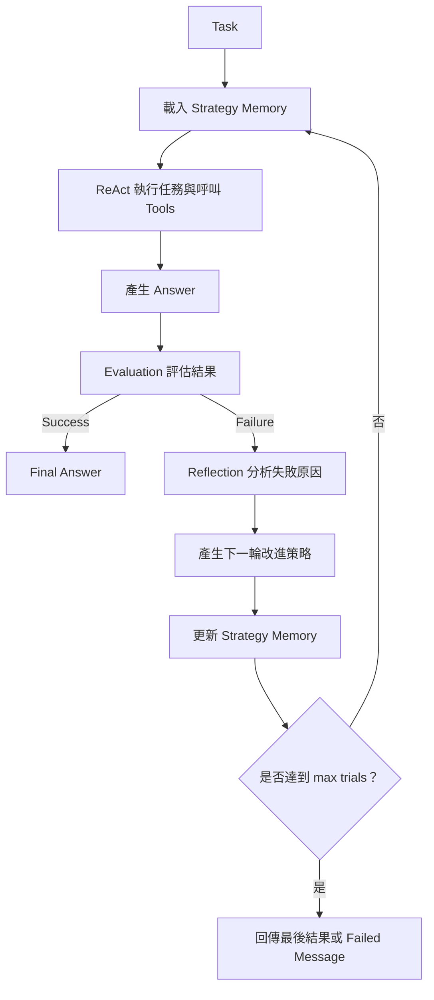

# AI Agent 架構：Reflection——以評估、反思與策略記憶迭代改善輸出

## 摘要

本節介紹 AI Agent 的 **Reflection** 架構。它是在先前的 [[ReAct]]／ReAct + Evaluation + Reflection + Retry + Strategy Memory 思路上再往前延伸：Agent 先執行動作取得答案，再用評估器檢查答案是否符合任務規則；若失敗，便根據輸出與評估回饋產生一條可重用的改進策略，保存到反思記憶中，並在下一次嘗試時把這段歷史帶回提示詞，讓 Agent 修正行為。

核心迴圈是：

> **Action → Evaluation → Reflection → Retry**

影片用「計算 21 + 21，並統計答案字串有多少個字元」示範：第一次 Agent 只算出 42，沒有使用指定的 `word_count` 工具，因此評估失敗；Reflection 產生「必須使用 `word_count` 工具」的策略後，第二次試行先呼叫計算工具，再呼叫字數統計工具，最後通過評估。（約 00:17:00–00:24:40）

## 為什麼需要 Reflection？

單次的 Agent 執行可能產生「看似合理、但不符合業務規則」的答案。例如，模型可以自行判斷字串 `42` 有兩個字元，結果在常識上正確，卻沒有依照任務要求實際呼叫 `word_count` 工具。若只看最終文字，可能不容易發現這個流程上的錯誤。

Reflection 將「檢查答案」與「修正下一次行為」明確化：

- **Evaluation** 負責判斷輸出是否符合業務規則、格式或語法要求。
- **Reflection** 將失敗原因整理成下一輪可執行的改進策略。
- **Strategy memory** 跨試次保存這些策略，下一輪會讀取。
- **Retry** 讓 Agent 根據新策略重新選擇工具與步驟。

因此，Agent 不只是重複執行同一個流程，而是把前一次失敗轉化為下一次的行為約束。（約 00:00:00–00:03:00）

> [!info] AI 補充
> Reflection 的重點不是讓模型「泛泛地自我檢討」，而是把評估結果轉成下一輪能使用的具體控制訊息，例如「先呼叫計算工具，再呼叫字數統計工具」。實際系統仍須依業務定義可檢查的規則與停止條件。


### 1. Action：先完成任務

Action 部分沿用 ReAct Agent 的執行方式：模型根據 task 與可用 tools 思考，選擇要呼叫的工具，取得 observation，再繼續下一個 action，直到可以產生 final answer。（約 00:03:00–00:04:30）

影片示範的 tools 包括：

- 計算工具：例如計算 `21 + 21`。
- 取得目前時間的工具。
- 字數／單詞統計工具：影片後段以 `word_count` 驗證答案字串長度。

實際業務應將這些簡單工具替換成符合業務需求的函式；工具越複雜，越需要清楚定義輸入、輸出與驗證規則。（約 00:02:00–00:03:00）

### 2. Evaluation：不是只看答案是否「像對的」

Evaluation 依業務需求判斷 final answer 是否成功。影片中的評估器包含兩種思路：

1. **規則優先**：先以程式檢查輸出是否包含必要內容、格式或指定結果。
2. **由 LLM 輔助評估**：規則檢查不足時，讓模型提供成功標誌、分數與 feedback。

示範任務的評估規則要求結果明確包含：

- `21 + 21` 的答案是 `42`。
- 答案字串 `42` 的字元數是 `2`。
- 流程必須使用 `word_count` 工具統計，而不是直接由模型自行寫出結果。

影片也指出，Evaluation 不一定要完全照這個例子實作；可以改成純手工解析與比對，也可以依不同業務設計不同的規則。（約 00:12:30–00:15:10）

### 3. Reflection：將失敗轉成可重用策略

當 Evaluation 回傳失敗時，Reflector 會讀取：

- 原始 task。
- Agent 的 last output。
- Evaluation 的分數。
- Evaluation 的 feedback。

接著產生一條短而具體的改進策略，追加到 `reflections`／strategy memory。下一次 Action 執行時，這個記憶會被放入提示詞，協助 Agent 避免重犯相同錯誤。（約 00:08:30–00:11:30、00:15:10–00:17:00）

影片中的 reflector prompt 為：

```text
Reflector given evaluation feedback
write one short improvement strategy
The agent should apply on the next attempt
最大就是20个字符
focus on tool choice format constraints missing steps
do not repeat the answer
reply with a single line
```

這個 prompt 的控制重點是：

- 只產生一條改進策略。
- 策略應在下一次嘗試中可直接套用。
- 聚焦工具選擇、格式限制與遺漏步驟。
- 不要重複完整答案。
- 以單行輸出，並限制長度。

### 4. State、Memory 與歷史的作用

在主迴圈中，`reflections` 是一個 list，用來保存失敗嘗試產生的反思策略。第一次 trial 時它通常是空的；若失敗，新的策略會被 append；第二次 trial 會把既有策略帶入 Action prompt。（約 00:08:30–00:10:30）

這種 memory 不是永久的通用知識，而是本次 task 執行期間累積的失敗歷史。它讓 Agent 在同一任務的後續嘗試中獲得上下文，形成「可累積的改進線索」。

## 架構與完整執行流程



完整流程如下：

1. **輸入 task**：主程式接收使用者問題。
2. **初始化反思記憶**：建立空的 `reflections` list，並設定 `last_output`。
3. **進入最大試次迴圈**：最多執行 `max_trials` 次。
4. **執行 Action**：將 task、目前的 reflections、LLM、tools 與 `max_action_steps` 傳給 ReAct action。
5. **產生 final answer**：Agent 透過工具呼叫與內部推理完成一次輸出。
6. **執行 Evaluation**：檢查答案內容、格式、語法、工具使用或其他業務規則，產生 success、score 與 feedback。
7. **成功分支**：若評估成功，立即 `return output`，整個程式結束。
8. **失敗分支**：若評估失敗，將 output、feedback 與 score 傳給 Reflector。
9. **更新記憶**：Reflector 產生一條策略，append 到 `reflections`。
10. **下一次嘗試**：把更新後的 strategy memory 放入下一輪 Action 的 prompt。
11. **達到上限仍失敗**：若已到 `max_trials`，回傳最後輸出或失敗訊息，不再無限執行。（約 00:04:30–00:08:30、00:17:00–00:20:00）

### 兩層迴圈限制

影片的參數同時限制不同層次的執行量：

- `max_trials`：Reflection 外層最多重新嘗試幾輪。
- `max_action_steps`：單次 ReAct Action 內最多執行幾個動作步驟。
- `max_reflection_steps`：Reflection 相關流程的最大步驟限制；影片展示的程式參數中也提到 `max_reflections`，用於限制歷史反思保存量。（約 00:08:00–00:09:30）

因此，外層可能執行多輪，而每一輪內部又有多個工具與推理步驟。這些上限共同避免 Agent 無止境地呼叫模型或工具。

> [!warning] 需要人工確認
> 影片口述中曾提到 `max_trials` 設為 3（示範段落中實際執行時使用 5），但示範中 Agent 在第二輪即成功，未觸及上限。筆記保留其核心意思：系統必須設定最大試次與反思記憶上限；具體數值應以實際程式碼或執行 log 為準。


### 入口函式：`main.py`

入口函式負責：

- 建立 LLM 連線。
- 準備 system message 與 task。
- 建立 tools 清單。
- 呼叫 `reflect_until_success`。
- 設定最大試次、單輪最大 action steps 與反思相關限制。
- 印出 log 與最終結果。（約 00:09:30–00:11:00）

### LLM 存取層：`ALM`／模型連線模組

影片提到以模型模組統一處理如何存取 DeepSeek、OpenAI 等模型。示範只使用 DeepSeek；若支援多模型，可增加對應的模型建立函式，並讓模型或 `BaseURL` 從 `Environment.example` 之類的環境設定讀取，以便切換模型。（約 00:00:50–00:02:00）

### Tools

Tools 是 Agent 可實際呼叫的函式。示範使用計算、取得時間與字數統計等簡單函式，目的是降低理解門檻；影片也提醒，真實業務應增加更有意義、較複雜的 function。（約 00:02:00–00:03:00）

### Action／ReAct

Action 會接收 task、反思歷史、LLM、tools 與單輪動作上限，依 ReAct 流程選擇工具並取得 observation，直到可以給出 final answer。（約 00:03:00–00:04:30、00:17:00–00:18:30）

### Evaluation

Evaluation 是業務專屬的品質閘門，回傳成功與否、分數及 feedback。它可以檢查：

- 結果是否正確。
- 是否符合指定格式。
- 是否使用必要工具。
- 是否符合語法或輸出要求。（約 00:04:30–00:06:00、00:12:30–00:15:10）

### Reflector

Reflector 根據 Evaluation 的輸出產生短策略，不重新回答原題。策略會被加入 reflections，並在下一輪送回 Action。（約 00:15:10–00:17:00）


### Reflection Agent 的 system message

影片示範的 system message 是：

```text
You are a reflection agent assistant
Follow the requested output format exactly
Use the same language as the task
```

其目的為：

- 指定 Agent 的角色。
- 要求嚴格遵循輸出格式。
- 要求使用與 task 相同的語言。（約 00:10:30–00:12:00）

影片認為這類 system prompt 可直接作為 Reflection Agent 的 template，也可以翻譯成中文；示範保留英文，理由是模型對中英文皆可處理，且英文技術提示可能較簡潔。（約 00:11:00–00:12:30）

### ReAct action prompt 的輸出控制

執行過程中，模型被要求使用類似以下格式：

```text
You solve tasks with tools use exactly this format each return
Action:
Action Input:

Stop when you can answer final answer
```

影片展示的實際 log 中，Agent 先以 calculator 得到 `42`，之後才在第一次嘗試產生 final answer；第二輪則因為 prompt 中加入了反思策略，補上 `word_count` 工具。（約 00:20:00–00:23:30）


### 任務

> 請計算 `21 + 21`，並統計答案有多少個字元。

### 第一次 trial

1. Agent 呼叫 calculator，得到 `42`。
2. Agent 直接自行判斷字串 `42` 有兩個字元。
3. Agent 產生 final answer，但沒有呼叫 `word_count`。
4. Evaluation 給出約 `0.3` 的分數，判定規則檢驗未通過。
5. Feedback 指出：未使用 `word_count` 統計答案字串的字元數。（約 00:20:00–00:22:20）

### 產生的反思策略

影片 log 中的策略重點是：

> 必須使用 `word_count` 工具統計答案字串的字元數，而不是直接輸出結果；先計算 `21 + 21` 得到 `42`，再統計字串 `42`，最後輸出結果。（約 00:21:30–00:22:40）

這段策略會被 append 到 strategy memory，並以類似以下標記放入下一輪 prompt：

```text
Past reflection strategy memory from failed attempts
```

### 第二次 trial

1. Agent 讀取上一輪的反思策略。
2. 先呼叫 calculator，得到 `42`。
3. 再呼叫 `word_count` 統計字串 `42`。
4. 產生「21 + 21 的結果是 42，該字串有兩個字元」的答案。
5. Evaluation 回傳 `1.0`，規則檢驗通過。
6. 系統回傳 output，Reflection Agent 結束。（約 00:22:40–00:24:40）

此例說明 Reflection 改變的不是單純的答案文字，而是下一輪的工具選擇與執行順序。

## 與其他架構的關係

| 架構               | 主要流程                                                 | 核心目的                 | 是否先規劃 | 是否評估並重試 |            是否保留失敗策略 |
| ---------------- | ---------------------------------------------------- | -------------------- | ----: | ------: | ------------------: |
| ReAct            | Thought → Action → Observation → 重複執行 → Final Answer | 邊思考邊使用工具完成任務         |     否 |       否 |                   否 |
| Plan and Execute | Planner 拆解步驟 → 逐步執行每個 Step → Final Answer            | 先規劃完整流程，再依序完成複雜任務    |     是 |     不一定 |                 不一定 |
| Reflection Agent | ReAct Action → Evaluation → Reflection → Retry       | 檢查執行結果，根據失敗原因修正後重新嘗試 |   不一定 |       是 | 是，會將改進策略帶入下一個 trial |


影片也提醒，實務上不必拘泥於「ReAct」或「Planner-Executor」等名稱；開發者可以根據業務融合多種思路，形成自己的 Agent 設計。（約 00:03:00–00:04:30）


### 優點

- **能修正流程錯誤**：不只檢查答案，也能要求下一輪補上遺漏的工具或步驟。
- **反思可跨 trial 重用**：失敗策略會進入下一輪 prompt，形成累積改善線索。
- **品質規則可依業務定義**：不同業務可以設定不同的 Evaluation，而不是套用單一標準。
- **降低人工盯場需求**：影片指出，多數時候 Agent 可以自行重跑並改善，使用者不必每一步都介入。（約 00:04:30–00:08:30）

### 限制與風險

- **可能重複犯錯**：若初始 prompt、工具、規則或任務定義本身有問題，Agent 可能在多輪中持續失敗。
- **消耗更多 token、時間與費用**：每次 retry 都可能再次呼叫模型與工具。
- **max trials 不是成功保證**：達到上限仍失敗時，只能回傳最後輸出或 failed message。
- **可能像「卡死」**：影片以程式撰寫情境為例，Agent 可能反覆嘗試卻產不出預期結果；必要時應停止並重新檢視任務或 prompt。（約 00:06:30–00:08:30）
- **Evaluation 品質決定整體品質**：規則過於寬鬆會放過錯誤，規則過於嚴格則可能讓 Agent 進入不必要的 retry。（約 00:12:30–00:15:10）

## 實務使用重點

設計 Reflection Agent 時，可依影片內容確認以下控制點：

1. 明確定義成功條件：答案正確、格式正確、工具使用正確，或其他業務要求。
2. 讓 Evaluation 回傳可操作的 feedback，而不只是 `false`。
3. 將 feedback 轉成短、具體、下一輪可套用的策略。
4. 把 reflections 明確注入下一輪 Action prompt。
5. 分別設定外層 `max_trials` 與內層 `max_action_steps`。
6. 限制反思記憶的保存量，避免 prompt 不斷膨脹。
7. 記錄每輪 trial、tool call、evaluation score、feedback 與 reflection，方便根據 log 理解 Agent 為何成功或失敗。（約 00:08:00–00:10:30、00:24:40–00:26:20）

影片建議學習者至少看過一次程式碼與整體時序圖；即使使用 AI 協助撰寫程式，也應掌握架構圖、時序與主要控制機制，避免只得到能執行但難以理解的程式。（約 00:24:40–00:26:20）

## 個人筆記

- 我如何定義某個業務的「成功」？哪些條件能由規則直接檢查？
- 如果 Evaluation 失敗，我希望 feedback 具體指出哪一個工具、格式或步驟出了問題嗎？
- 我的 Reflection 策略是否能直接影響下一輪 Action，而不是只重述原答案？
- `max_trials`、`max_action_steps` 與反思記憶上限應如何設定，才能在品質與成本間取得平衡？
- 若 Agent 在所有 trial 中都失敗，我應先檢查 prompt、工具定義、Evaluation，還是原始 task？
- 我的 log 是否足以重建每一輪的 Action、Evaluation、Reflection 與 Retry 流程？

## 參考資料

- 影片：AI_Julie，〈03-AI Agent 架構 - reflection〉，bilibili，BV1fSV26aEMQ。影片長度約 26 分 38 秒。  
  [影片連結](https://www.bilibili.com/video/BV1fSV26aEMQ/)
