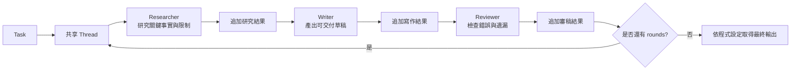

# AI Agent 架構：Multi Agent Crew 多角色輪詢

## 摘要

本課介紹一種簡單的多角色 Agent 架構：**Multi Agent Crew 多角色輪詢**。多個具有不同職責的角色，按照固定順序閱讀同一條對話線（`thread`），每次完成任務後把輸出追加到 thread，讓下一個角色閱讀完整上下文並繼續工作。

影片以三個角色示範一條極簡協作鏈：

1. `researcher`：研究任務，整理關鍵事實與限制。
2. `writer`：根據任務與研究結果，產出可交付草稿。
3. `reviewer`：檢查錯誤與遺漏，提出修改建議，或判定內容已足夠好。

整體採用固定順序的多角色流水線。每一輪內部皆依照 researcher → writer → reviewer 的固定順序執行；外層則可透過 rounds 重複執行整條流程，因此不是像開發流程中「設計 → 開發 → 測試 → 發現 Bug 後回到開發」那種由執行結果動態決定下一步的迴圈，而是固定角色、固定順序的多輪協作。（00:00–00:02:20、00:06:30–00:09:20）

## 為什麼需要多角色輪詢

單一 Agent 可以一次回答簡單問題，但較複雜的工作通常需要先規劃或研究，再撰寫，最後檢查品質。把工作拆成不同角色，可以讓每個角色在執行時使用清楚的人設、職責與提示詞。

影片用日常工作與寫程式作比喻：

- 寫作通常需要「先計畫、再寫作、寫完再審核」。
- 程式開發也常需要在完成後進行 code review。
- 同一個人可能兼任多種工作，但執行某個階段時，仍會依照該角色的職責思考。（00:02:20–00:03:35）

這種架構特別適合可以拆成明確階段、而且各階段有固定先後關係的流水線工作。它的優點不是讓角色自由協商，而是讓協作順序與上下文傳遞方式容易理解、容易實作。


### 1. 共享 `thread`：一個持續追加的黑板

`thread` 是所有角色共同閱讀的對話線，也可以理解為共享黑板：

- 一開始放入原始 `task`。
- `researcher` 完成後，把研究結果追加到 thread。
- `writer` 讀取 task 與研究結果，完成後再追加草稿。
- `reviewer` 讀取 task、研究結果與草稿，再進行審核。
- 下一輪的角色可以看到前一輪已經累積的內容。

因此，角色之間不需要透過額外的獨立資料結構傳遞結果；輸出會持續追加到同一條 thread，成為後續角色共同閱讀的共享上下文。（00:01:30–00:02:10、00:04:50–00:06:10）

> [!info] AI 補充
> 這裡的「記憶」是工作流程中的上下文記憶，不等同於跨任務、永久儲存的長期記憶。影片只說明輸出會保留在 session/thread 中，未涉及資料庫、向量庫或長期記憶機制。

### 2. 固定 `order`：角色依序執行

`default_order` 定義角色執行順序。影片中的順序是：

```text
researcher → writer → reviewer
```

這是固定順序的線性流程，每個角色完成後直接交由下一個角色執行，而不是由角色自行決定下一步。每個角色完成後，直接把控制權交給順序中的下一個角色。（00:05:35–00:06:30）

### 3. `rounds`：外層輪數

`rounds` 表示整條角色管道要重複執行幾次。影片將 `rounds` 設定為兩輪：

- 第 1 輪：`researcher → writer → reviewer`
- 第 2 輪：再次執行 `researcher → writer → reviewer`

第二輪並不是清空上下文重新開始；它會在第一輪已累積的 thread 上繼續工作。輪數越多，送給模型的 prompt 通常越長，因此也可能增加上下文長度與 token 限制的壓力。（00:07:35–00:09:20）

### 4. 每個角色有不同 prompt

角色的差異主要由各自的 prompt 定義：

- **Researcher prompt**：根據任務與現有對話，列出關鍵事實與限制；不要寫成最終成品，保持簡潔條目。
- **Writer prompt**：閱讀現有內容，產出清楚、可交付的草稿答案。
- **Reviewer prompt**：檢查草稿中的錯誤與遺漏，提出修改；若內容已經足夠好，則可以通過。（00:03:40–00:05:20）

對簡單任務而言，角色可能只需要不同的提示詞；對更複雜的業務任務，則可以為各角色加入更完整的規則與處理邏輯。影片沒有進一步指定工具、結構化輸出格式或外部資料來源。

## 架構



架構可分成三個層次：

1. **任務層**：定義使用者要完成的工作，例如在 150 字內解釋 ReAct Agent 及其為何需要 observation。
2. **角色層**：由 `researcher`、`writer`、`reviewer` 等角色負責不同階段。
3. **執行層**：由 Crew 按照 `rounds` 與 `order` 控制輪數及順序，並將每次模型輸出追加到 thread。（00:01:00–00:02:10、00:05:35–00:06:30）

### 與前面 Agent 模式的關係

影片將此架構與先前介紹的 Apply and Execute、ReAct、Reflection 等 Agent 模式相比，認為多角色輪詢較簡單、容易理解。原因是它模仿人類熟悉的分工流程：研究、撰寫、審核，而不是讓單一 Agent 自行決定複雜的行動與反思策略。（00:12:05–00:12:45）

這裡的差異可概括為：

- **多角色輪詢**：重點在固定角色、固定順序、共享 thread。
- **開發式迴圈**：可能在測試發現問題後返回開發階段。
- **本課示範**：reviewer 可以判定「無需修改」，但流程仍依照預先設定的 `rounds` 繼續，不是由 reviewer 自動決定是否重新寫作。


### `main.py`

影片將它描述為入口函式，負責啟動整個流程，例如執行 Python 入口程式。（00:00:50–00:01:10）

### `crew.py`

這是 Agent Crew 的核心，負責：

- 接收或使用已建立的模型連線。
- 取得任務與角色設定。
- 依照 `rounds` 執行多輪。
- 依照 `default_order` 逐一呼叫角色。
- 將每個角色輸出追加至 thread。
- 在流程結束後輸出結果。（00:00:50–00:01:10、00:06:30–00:07:35）

### `roles.py`

定義有哪些角色，以及每個角色的 prompt。影片示範的三個角色為：

| 角色 | 職責 | 主要輸出 |
|---|---|---|
| `researcher` | 根據 task 與 thread 整理關鍵事實、限制與研究結果 | 簡潔條目，不直接寫最終答案 |
| `writer` | 閱讀現有內容並撰寫答案 | 清楚、可交付的草稿 |
| `reviewer` | 檢查草稿錯誤與遺漏，必要時提出修改 | 審核意見、修改建議，或通過判定 |

### 語言模型

影片使用 DeepSeek 模型，並指出也可以替換成其他模型。模型本身不是此架構的重點；重點是同一個模型或不同模型都能依照各自角色 prompt 參與固定流程。（00:03:00–00:03:35）

### 環境設定

影片提到快速開始時需要先填寫 environment，之後可以執行入口 Python 程式；但逐字稿沒有列出具體環境變數名稱、值或安裝指令，因此不在此補寫未提供的設定細節。（00:02:00–00:02:20）


### 第 1 輪

假設 task 是：

> 為團隊寫一段 150 字以內的說明，解釋 ReAct Agent 是什麼，以及它為什麼需要 observation。

執行順序如下：

1. **建立 task 與初始 thread**：thread 先包含原始任務。
2. **呼叫 researcher**：研究員根據 task 與目前 thread，列出關鍵流程、事實與限制，不直接寫成最終文案。
3. **追加 researcher 結果**：將研究輸出附加至 thread，使 thread 變成「task + researcher」。
4. **呼叫 writer**：寫作者閱讀 task 與 researcher 結果，寫出一段草稿。
5. **追加 writer 結果**：thread 變成「task + researcher + writer」。
6. **呼叫 reviewer**：審稿者根據完整內容檢查草稿，尋找錯誤與遺漏，並判斷是否需要修改。
7. **追加 reviewer 結果**：審核結果也會保留在 thread 中。（00:07:35–00:08:50）

影片示範中，reviewer 判定內容無需修改，並說明可以直接使用。（00:08:20–00:08:55）

### 第 2 輪

因為 `rounds = 2`，流程不會在第一輪 reviewer 通過後立即停止，而是再次從 `researcher` 開始：

1. researcher 讀取第一輪累積的內容並再整理一次。
2. writer 參考前面累積的 task、研究與草稿，再產出新的結果。
3. reviewer 再次審核第二輪的內容。
4. 流程結束後，將團隊結果輸出給使用者

> 逐字稿無法完全確認最終輸出是 writer 的結果、reviewer 的審核結果，還是完整 thread 中的指定部分，逐字稿與文章描述不完全一致，需人工確認實際程式的最終取值邏輯。。（00:08:50–00:10:40）

### 控制與停止條件

本課程示範的停止條件是**固定輪數耗盡**：設定兩輪就執行兩輪。影片沒有描述由 reviewer 觸發的自動 retry，也沒有描述「reviewer 發現錯誤後跳回 writer」的條件分支。

因此要區分兩件事：

- `reviewer` 的「需要修改／無需修改」是品質判斷結果。
- `rounds` 才是本示範中真正控制流程是否繼續的外層條件。

如果設定更大的輪數，模型可能有機會再次改善結果，但影片也明確提醒這不是必然，而且 prompt 會持續變長。（00:10:40–00:11:50）

> [!warning] 需要人工確認
> 逐字稿未提供實際程式的最終取值邏輯，因此實作時應確認究竟輸出 writer 結果、reviewer 修訂結果，還是完整 thread 中指定的 final answer。

## 示範任務

影片實際示範的是一個相對簡單的說明型任務：在 150 字以內說明 ReAct Agent 以及 observation 的必要性。（00:03:35–00:04:20）

這個任務其實一次呼叫模型就可能完成，但影片用它來展示角色協作的資料流：

```text
第 1 輪：
Task
  → Researcher：整理 ReAct 與 observation 的重點
  → Writer：根據研究結果寫 150 字草稿
  → Reviewer：檢查錯誤與遺漏，判斷是否需要修改

第 2 輪：
上一輪完整 Thread
  → Researcher
  → Writer
  → Reviewer
  → 最終輸出
```

示範輸出中，reviewer 認為草稿不需要修改，因此通過內容。這展示了「先研究、再寫作、最後審稿」的最小協作鏈，而不是展示複雜任務本身。（00:08:00–00:10:40）


### 優點

- **容易理解**：角色職責與人類工作流程相似。
- **流程清楚**：透過固定 `order` 決定每個階段的執行順序。
- **上下文共享簡單**：每個輸出都追加到同一個 thread，後續角色可以看到全文。
- **適合流水線工作**：研究、撰寫、審核等階段通常有明確先後關係。
- **角色定義集中**：不同角色可透過獨立 Prompt 定義職責，方便依需求調整或新增角色。（00:00:50–00:02:20、00:03:35–00:05:20）

### 限制

- **不是動態修正迴圈**：本示範沒有讓 reviewer 自動把工作退回 writer，也沒有依照審稿結果改變下一步。
- **多輪不保證更好**：影片指出多跑幾輪可能改善結果，但不能保證每次都更準確。
- **上下文會持續變長**：每輪都把內容追加到 thread，送給模型的 prompt 會越來越長。
- **受 token 限制影響**：不同模型的上下文長度有限，輪數與輸出過長可能造成限制。（00:10:40–00:12:05）
- **簡單任務可能過度設計**：影片示範的 150 字說明其實一次模型呼叫即可完成，多角色架構的價值主要在較複雜的業務任務。

## 適用情境

這種架構適合可拆成固定階段的工作，例如影片提到的：

- 研究資料後撰寫內容，再進行審稿。
- 研究、撰寫、審核等具有固定先後順序的工作流程。
- 需要多人或多個專責角色接續完成的流水線任務。
- 結果需要經過獨立審核，且每個階段輸入輸出相對明確的工作。（00:00:00–00:02:20、00:04:50–00:05:35）

對於需要根據錯誤類型動態分支、呼叫工具、反覆修復 Bug 或由 Agent 自行選擇下一個行動的任務，影片沒有主張本架構足以處理；這類需求需要另外設計條件分支或更複雜的 Agent 控制策略。

> [!info] AI 補充
> 實務上，若要把這個流水線用於較長文件，通常需要另外設計摘要、上下文裁切或結構化狀態，以控制 thread 長度；這是一般工程上的延伸設計，影片未示範具體做法。

## 個人筆記與思考

- 這種固定順序的角色協作，與我目前理解的單一 Agent 流程相比，最有價值的分工點是哪一個？
- 如果 reviewer 發現錯誤，應該由誰決定是否回到 writer？需要哪些明確條件？
- `rounds` 應該固定設定，還是應該由 reviewer 的評分或通過狀態控制？
- thread 持續追加時，什麼時候需要摘要或刪除舊內容？
- 最終輸出應該取 writer、reviewer 的修訂內容，還是從 thread 中另外標記一個 final answer？
- 對實際業務任務而言，researcher 的「關鍵事實與限制」是否需要改成結構化格式，才能讓 writer 更穩定地使用？
