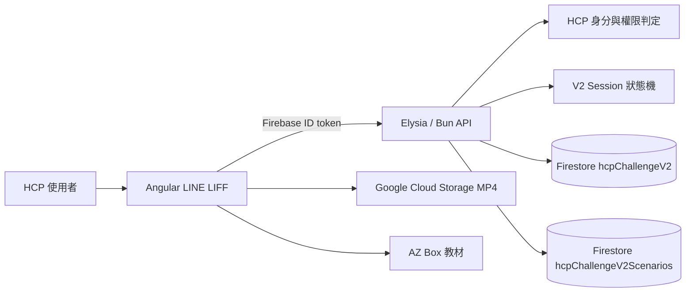

# AZTW CRESTCODE 遊戲使用流程改版

## 任務目標

根據 AZTW CRESTCODE 0630 改版的 BRD、PRD 與 2026-08-25 起始會議簡報，整理成可供開發、測試與後續追蹤使用的任務文件。

本次改版將舊版「兩題制」流程調整為「一題制＋影片頁」，新增家族樹案例入口，並依最新健保降血脂給付規定更新題目與解析。同時需要重新規劃 V2 報表與 Audit Log，讓 HCP 的遊玩、影片、簡報下載及 LINE 轉化歷程可以被追蹤。

## 目前進度摘要（2026-09-15）

- **實作狀態：** V2 前後端主要流程、六位角色、身份判定、題目內容、影片、完成頁、事件追蹤與每日報表已完成，並已部署過 Stage 版本。
- **資料狀態：** 玩家紀錄使用 `sites/astrazeneca/hcpChallengeV2/{challengeId}`；題目版本使用 `sites/astrazeneca/hcpChallengeV2Scenarios/{scenarioVersionId}`。V2 不寫入 V1 collection。
- **驗證證據：** 後端 `bun test` 為 230 pass、0 fail；前端 `npm run build-stage` 成功；已檢查一份實際 24 欄 Excel 報表。
- **尚未結案：** production Firebase／scenario seed、目標手機與 LINE WebView 驗收、SendGrid 正式投遞、核准 BCC 名單，以及 V1／V2 主選單與報表切換仍需由團隊與 AZ 確認。

## 專案資訊

- 客戶：AstraZeneca Taiwan（AZTW），租戶代號 `astrazeneca`
- 平台：LINE LIFF 前端＋LINE CRM／AZ-BOT Console 後台
- 版本：0630 改版（V2）
- 起始會議：2026-08-25
- 需求文件作者：`abby@aiii.ai`
- 首發案例：冠嬸
- 前端入口：本版本使用全新的 LIFF 連結，正式 URL 由客戶上線前提供
- 後端 Repository：<https://github.com/Aiii-Developers/astrazeneca-hcp-api>
- 前端 Repository：<https://github.com/Aiii-Developers/astrazeneca-liff-med>
- 後端 Draft PR：<https://github.com/Aiii-Developers/astrazeneca-hcp-api/pull/90>
- 前端 Draft PR：<https://github.com/Aiii-Developers/astrazeneca-liff-med/pull/52>

## 我的角色與責任範圍

這是我實習期間第一次接手橫跨前端、後端、Firebase 與 LINE LIFF 的既有商業專案。我在 Tiffany 的交接、團隊工程師 review，以及 AI coding assistant 的協作下，負責把分散在 BRD、PRD、會議簡報、Figma 與舊版程式中的需求整理成可實作規格，並完成 CRESTCODE V2 的主要開發與 Stage 驗證。

我實際負責的工作包括：

- 釐清 V1 與 V2 的差異，將需求拆成身分判定、家族角色、題目內容、作答、影片、教材、完成頁與事件追蹤等流程。
- 同時修改 `astrazeneca-hcp-api` 與 `astrazeneca-liff-med`，建立前後端一致的資料型別、API 契約與狀態轉移。
- 將六位家族成員的題目、答案、解析、Reference、影片及教材設定放入 Firestore 管理，避免每次改文案都需要重新部署前端。
- 設計只屬於 CRESTCODE V2 的 Firestore bounded context，確保資料整理與搬移不影響公司同一個 site 下的 V1 或其他產品資料。
- 處理跨角色錯誤續玩、完成角色顯示、圖片載入、手機影片播放及 LIFF 本機測試等整合問題。
- 補上後端與前端測試、整合文件、Stage tag 與 Pull Request，讓成果可以被團隊 review、部署與接手。

不屬於我單獨決定的範圍包括醫療文案核決、正式站部署時間、正式 LIFF URL、V1 報表下線時間與客戶最終驗收；這些仍需由 AZ、PM、Medical／Compliance 與團隊共同確認。

### 需求來源

- `C:\Users\user\Downloads\AZTW_CRESTCODE_使用流程改版_BRD.md`
- `C:\Users\user\Downloads\AZTW_CRESTCODE_PRD.md`
- `C:\Users\user\Downloads\0825_meeting_slides.html`
- 舊版 Figma：[AstraZeneca HCP 業代 Liff 公版（V1）](https://www.figma.com/design/OXErFSa4skc4885havEMrZ/AstraZeneca-HCP-%E6%A5%AD%E4%BB%A3-Liff%E5%85%AC%E7%89%88?node-id=5050-5934&t=Qukl7QOix1Hr4Dka-4)
- 新版 Figma：[AstraZeneca HCP 業代 Liff 公版（V2）](https://www.figma.com/design/OXErFSa4skc4885havEMrZ/AstraZeneca-HCP-%E6%A5%AD%E4%BB%A3-Liff%E5%85%AC%E7%89%88?node-id=6097-1512&t=Qukl7QOix1Hr4Dka-4)
- 視覺設計稿：[AstraZeneca HCP 業代 Liff 公版](https://www.figma.com/design/OXErFSa4skc4885havEMrZ/AstraZeneca-HCP-%E6%A5%AD%E4%BB%A3-Liff%E5%85%AC%E7%89%88?node-id=6097-1512&t=53dF7U4fHakQOiK8-1)
- 題目與設計原始檔：[Google Drive 題目檔案](https://drive.google.com/drive/folders/1_mXiMpQXtOwAWX8PpyAl4XmfFKZ6zUKI?usp=drive_link)

## 改版重點

- 兩題問答改為每個家族成員一題，情境說明與題目合併在同一頁。
- 新增家族樹案例入口，讓 HCP 先選擇家族成員再進入挑戰。
- 新增 16:9 學術影片頁，位於答題解析與下載簡報頁之間。
- 依最新《全民健康保險降血脂藥物給付規定》更新題目、答案與解析。
- 結尾依 HCP 身分顯示不同 CTA，未驗證 HCP 額外引導註冊 AstraZeneca 官方 LINE。
- 終止 V1 舊報表並建立 V2 新報表；新舊報表切換時間需與 AZ 事先約定。

## 系統架構與技術設計

### 跨 Repository 架構



前端不自行判定正確答案或信任網址中的 LINE UID。每個 V2 request 都帶 Firebase ID token，後端以驗證後的 `uid` 作為玩家身分，並重新檢查 site、session ownership 與可執行的下一個狀態。這讓「畫面顯示到哪一步」與「伺服器認定做到哪一步」保持一致，也避免使用者竄改 request body 跳過流程。

### Firestore bounded context

公司資料庫的 `sites/astrazeneca` 底下還有許多既有產品資料，因此本次將 V2 的玩家資料與題目內容限制在明確的 V2 bounded context。玩家資料集中在：

```txt
sites/astrazeneca/hcpChallengeV2/{challengeId}
```

每一個 `challengeId` 是一位使用者的一筆遊玩文件，使用亂數文件 ID；同一份文件內嵌六位角色的進度與事件：

```txt
sites/astrazeneca/hcpChallengeV2/{challengeId}
  ├─ profile fields              # 非已驗證 HCP 填寫的基本資料
  ├─ memberProgress              # 六位角色各自的狀態、答案、影片與完成時間
  ├─ startRequests               # 開始遊戲的 idempotency 紀錄
  ├─ events                      # 影片、教材、LINE CTA 等事件
  └─ completion projection       # 完成六位角色後的統計投影
```

題目與素材內容另由可管理的 scenario 文件保存：

```txt
sites/astrazeneca/hcpChallengeV2Scenarios/{scenarioVersionId}
```

`hcpChallengeV2Scenarios` 每一筆代表一個角色的題目版本，包含選項、正解、解析、Reference、影片／教材資源，以及 `published`、`approved`、`effectiveAt`、`expiresAt` 等上架控制欄位。執行環境以 Firestore 為優先來源；資料庫暫時不存在或只發布部分角色時，才使用程式碼內的六組核准內容作安全 fallback。V2 runtime 不再建立 `profile`、`participant`、`session`、`activeSession` 或 `auditEvent` 子 collection，也不修改 V1 或其他產品資料。

這項設計的目的不是單純減少 collection 數量，而是把 CRESTCODE V2 當成一個清楚的資料邊界：玩家紀錄、題目版本、migration、seed、測試與日後清理都有明確範圍，不碰 V1 與其他公司資料。

### Session 狀態機

```txt
family_selection → question → explanation → video → material → completed
```

- 後端只接受合法的下一步，跳步或狀態衝突回傳 `409 Conflict`。
- 題目送出後由後端判分，正確答案與解析不會在作答前送到前端。
- 開始、選角、送答案與換頁都使用 idempotency key，降低重複點擊或網路重送造成重複資料的風險。
- 每位家族成員有獨立 session。使用者離開 A 角色的影片頁後，再點 A 可以續玩；點 B 則必須從 B 的題目開始。
- 角色只有在進入 `completed` 後才解鎖彩色圖，單純選取或答完題目不算完成；解鎖狀態由後端回傳，所以重新整理後仍能保留。

### V2 API 契約

本次建立或整合 11 個 V2 endpoint：

| Endpoint | 用途 |
| --- | --- |
| `POST /hcp-challenge/v2/identity` | 判定 verified、pending、unregistered、revoked 與結果頁 CTA |
| `POST /hcp-challenge/v2/family-members` | 取得六位成員及完成／可用狀態 |
| `POST /hcp-challenge/v2/scenario-content` | 取得已上架且核准的公開題目內容 |
| `POST /hcp-challenge/v2/start` | 建立家族選擇 shell 或以選角方式 retry-safe 開始 |
| `POST /hcp-challenge/v2/profile-status` | 查詢非已驗證 HCP 是否已填過資料 |
| `POST /hcp-challenge/v2/profile` | 儲存姓名、縣市與服務院所 |
| `POST /hcp-challenge/v2/select-member` | 將角色與該角色 session 綁定 |
| `POST /hcp-challenge/v2/answer` | 伺服器端判分並回傳解析、影片與教材 |
| `POST /hcp-challenge/v2/advance` | 驗證 explanation、video、material、completed 的狀態轉移 |
| `POST /hcp-challenge/v2/track` | 記錄前端擁有的漏斗事件 |
| `POST /hcp-challenge/v2/reports` | 提供同 site 管理者查詢 V2 統計 |

### 前端呈現與媒體策略

- 使用 Angular Material `mat-spinner` 取代載入中文字，讓初始化與圖片載入有一致的等待回饋。
- 題目圖片先以 `Image` 物件預載，完成後才顯示案例內容，避免使用者先看到破圖或版面跳動。
- 家族卡片區分 available、selected 與 unlocked；selected 只表示目前點選，unlocked 才控制彩色圖。
- 原本 Box iframe 在桌面可播、手機 LIFF 卻無法正常觸控，因此改把 MP4 放在 Google Cloud Storage，以原生 `<video controls playsinline>` 播放，並保留外部開啟連結作為 fallback。
- 結果頁依 HCP 身分顯示不同 CTA；影片頁的「點我下載簡報」依確認後流程直接進入最終結果頁，不再多顯示一個重複的中繼頁。

## HCP 身分與頁面權限

身份判定由後端在 LIFF 開啟時執行，前端只依判定結果控制頁面與按鈕顯示；每次 API 操作仍需由後端重新驗證身份。

| 身分 | 進場規則 | 可見流程 | 結尾頁 CTA |
| --- | --- | --- | --- |
| 已驗證 HCP | 系統自動登入，免填基本資料 | 家族樹 → 問答／答頁彈窗 → 影片 → 下載簡報 | 領取指引整理、再玩一次；不顯示 LINE 按鈕 |
| 待驗證 HCP | 已有註冊資料但尚未完成驗證；已有資料者免重填 | 家族樹 → 問答／答頁彈窗 → 影片 → 下載簡報 | 領取指引整理、再玩一次；不顯示 LINE 按鈕 |
| 非已驗證 HCP | 首次需填姓名、縣市、服務院所；已有提交紀錄者免重填 | 註冊 → 家族樹 → 問答／答頁彈窗 → 影片 → 下載簡報 | 領取指引整理、註冊 AZ 官方 LINE、再玩一次 |
| 已註銷 HCP | 系統判定身份已註銷 | 阻擋訊息頁，不得進入遊戲 | 不適用 |

其他角色：

- **Sales**：開啟業務專屬邀請畫面，展示 QR Code、今日參與人數與總累計參與人數。
- **Admin**：管理案例內容與上下架、關聯影片／簡報資源，查看遊玩紀錄與 V2 統計報表。

## 使用流程

1. Sales 由業務端開啟專屬邀請畫面，讓 HCP 掃描 QR Code 或使用邀請連結。
2. LIFF 開啟後取得 LINE UID，由後端判定 HCP 身分。
3. 已註銷 HCP 顯示阻擋訊息；非已驗證 HCP 依規則完成基本資料；其他可進入者前往家族樹。
4. HCP 在家族樹選擇一位家族成員，進入該成員的一題制案例挑戰。
5. 問答頁同時呈現情境與題目；送出後顯示答案解析彈窗與 Reference。
6. 點擊下一步進入影片頁，觀看該家族成員的學術個案分析影片。
7. 點擊「點我下載簡報 →」直接進入最終結果／簡報頁，不另外顯示重複的中繼頁。
8. HCP 可在結果頁領取指引整理、再玩一次；非已驗證 HCP 另顯示註冊 AZ 官方 LINE 按鈕。
9. 後台以 V2 報表追蹤身份、家族成員、影片、簡報下載與 LINE 轉化結果。

## 頁面與功能規格

| 頁面／功能 | V1 狀態 | V2 調整 | 主要對象 |
| --- | --- | --- | --- |
| 業務端邀請畫面 | 既有 | 保留 QR Code；顯示今日與總累計參與人數。依 PRD／會議結論，本版總累計可歸零重新計算 | Sales |
| 註冊頁 | 既有 | 僅非已驗證 HCP 首次使用；姓名、縣市、服務院所寫入 CRM | 非已驗證 HCP |
| 家族樹頁 | 新增 | 顯示「阿冠家族案例分析」，可任選家族成員 | 可進入遊戲的 HCP |
| 問答頁 | 需調整 | 情境與題目合併為一頁，每個案例僅一題 | 可進入遊戲的 HCP |
| 答頁彈窗 | 既有 | 顯示作答結果、健保規定解析與學術 Reference | 可進入遊戲的 HCP |
| 影片頁 | 新增 | 內嵌 16:9 學術個案分析影片，提供前往下載簡報的按鈕 | 可進入遊戲的 HCP |
| 結果／下載簡報頁 | 既有 | 提供指引整理、再玩一次；依身份決定是否顯示 LINE CTA，不再拆成兩個頁面 | 可進入遊戲的 HCP |
| V2 報表／案例管理 | 既有機制需改版 | 結束 V1 報表，建立符合一題制＋影片頁的新漏斗；管理案例上下架及影片／簡報資源 | Admin |

## 家族樹解鎖機制

- 家族成員：冠嬸、冠爺、冠媽、冠爸、冠叔、阿冠。
- 預設所有成員以黑白 silhouette 剪影呈現，可直接任選一位挑戰。
- 使用者完成挑戰後，不論答對或答錯，該成員即點亮解鎖。
- 尚未解鎖的成員仍可任選挑戰；全部成員解鎖後仍可任選成員重複遊玩。
- 首發案例為「冠嬸」；選取成員時需有彩色圖像與高亮狀態，並啟用下一步按鈕。

## 首發案例：冠嬸

### 個案設定

- 性別：女性
- 年齡：55 歲
- 共病：高血壓
- 臨床情境：高血脂治療仍未達標，需要設定治療策略與防護標準。

### 一題制問答

題目：根據最新《全民健康保險降血脂藥物給付規定》，冠嬸的 LDL-C 治療目標應設定為？

選項：

- A. `< 130 mg/dL`（正確答案）
- B. `< 115 mg/dL`
- C. `< 100 mg/dL`
- D. `< 70 mg/dL`

解析需說明：冠嬸符合「女性年齡 >= 55 歲」與「高血壓」共 2 項危險因子，且始藥前已進行 3–6 個月飲食治療；若始藥前 LDL-C 仍 `>= 130 mg/dL`，藥物治療收案與降脂目標為 `< 130 mg/dL`。底部列出對應學術文獻 Reference。

### 素材規格

- 影片：16:9、MP4 H.264、預計 60–90 秒；原需求預計使用 AZbox，Stage 實作因手機相容性改用 Google Cloud Storage 公開 MP4。
- 簡報：`Crestor_血脂管理共識指引整理.pdf`，以 PDF 開啟／下載。
- 文案、答案、解析、影片與簡報素材需經 AZ Medical／Compliance 核決後才能上線。

## Audit Log 與 V2 報表

### 必記錄節點

1. **進入首頁**：進入時間、HCP 身份；已註銷 HCP 僅記錄阻擋事件。
2. **選擇家族角色**：成員名稱與選擇時間。
3. **提交答案**：使用者選項與是否答對（BRD 明列，PRD 的欄位清單未完整列出，需驗收前確認）。
4. **影片互動**：是否點擊播放；BRD 另要求播放長度，需確認是否納入正式欄位。
5. **下載簡報**：下載按鈕點擊次數，欄位可參考[既有 Google 試算表](https://docs.google.com/spreadsheets/d/10_wwgF35EIHMXketiMVLgtE6Gp_nAtek/edit?usp=sharing&ouid=116500601244804166322&rtpof=true&sd=true)。
6. **LINE 轉化**：非已驗證 HCP 的官方 LINE 註冊按鈕點擊與成功綁定結果。

後台需能以單一使用者／單次遊玩回填完整軌跡，例如：身份、進入時間、選擇「冠嬸」、作答、影片點擊、簡報下載與 LINE 註冊結果。

### 報表切換規則

- V1 為兩題制漏斗；V2 改為一題制＋影片頁，需終止／結束 V1 舊報表。
- 建立新的 V2 報表，漏斗至少涵蓋：進入 → 答題 → 播放影片 → 下載簡報 → 點擊註冊 LINE。
- 新舊報表切換與部署時間需先與 AZ 約定，於約定時間執行資料庫與報表切換。
- 沿用既有欄位命名、Audit Log 事件記錄方式與資料回填邏輯時，需在開發文件中標記為「既有規則」。
- 使用全新的 LIFF 連結，與 V1 入口區隔；正式連結由客戶上線前提供。

## CMS 與開發邊界

### 已確認／應納入

- Admin 可管理案例上架／下架。
- Admin 可設定或上傳案例關聯的影片與簡報資源。
- Admin 可查看 V2 遊玩數據與漏斗統計。

### Nice-to-have／需確認範圍

BRD 將以下項目列為 Nice-to-have，但風險對策又建議內容資料庫化，需由 PM／AZ 確認是否納入本期：

- 動態編輯家族成員名稱。
- 動態編輯題目、四個選項與解析文案。
- 動態替換影片 URL 與簡報下載連結。

## 實際交付成果

### 後端

- 建立 CRESTCODE V2 identity、content、session、answer、advance、track 與 report API。
- 以 Firebase ID token 綁定玩家身分，阻擋 body identity spoofing、跨 site 與非 session owner 操作。
- 將六位家族成員的正式題目內容寫入 `hcpChallengeV2Scenarios`；公開 DTO 不包含正確答案與上架控制欄位。
- 建立 `hcpChallengeV2` 玩家文件與 `hcpChallengeV2Scenarios` 題目文件的資料模型、migration／rename script、seed script 與影片 URL 更新 script。
- 實作 database-first content resolver：優先讀 Firestore；若本機／部署環境暫時沒有完整六組已核准內容，才回退至程式碼中的核准內容，避免空白題目頁。
- 實作 server-side 狀態機、idempotency、concurrent answer protection、每角色獨立續玩及完成角色 projection。
- 建立 V2 事件追蹤與報表聚合，能依日期、角色、業務與事件統計 unique participants、開始／完成次數及 CTA；每日 Excel 報表固定 24 欄、每場遊玩一列，從最早有效 V2 紀錄累計至報表日期，不按月份重置。
- 保留 V1 route 與既有資料，不以 V2 migration 修改或刪除非 V2 collection。

主要檔案：

- `src/routes/hcp-challenge-route.ts`
- `src/services/hcp-challenge-v2-session.ts`
- `src/services/hcp-challenge-v2-content.ts`
- `src/services/hcp-challenge-v2-analytics.ts`
- `src/services/hcp-challenge-v2-firestore.ts`
- `src/services/hcp-challenge-identity.ts`
- `src/config/hcp-challenge-v2-content.ts`
- `scripts/migrate-hcp-challenge-v2-firestore.ts`
- `scripts/seed-hcp-challenge-v2-firestore.ts`
- `scripts/update-hcp-challenge-v2-video.ts`
- `docs/hcp-challenge-v2.integration.md`

### 前端

- 建立獨立的 `HcpChallengeV2Component`、module、model 與 API service，串接完整 V2 API。
- 完成 profile、family、question、explanation、video、result、blocked 與 error 等畫面狀態。
- 依 Figma 與實際截圖調整家族樹、題目、答案彈窗、影片頁與兩種身分結果頁。
- 將題目頁整理為「案例背景／案例圖／臨床決策挑戰／題目」分格排版；依 Figma 在案例標題加入 HP／HP+GP 標記，並以角色及出現次數控制選擇性粗體。
- 將非已驗證 HCP 的第一頁改為姓名、縣市、服務院所資料表單；服務院所支援下拉選擇與手填備註，提交資料寫入 V2 玩家文件並供報表回填。
- 加入六位家族角色黑白／彩色素材與六張案例圖，完成圖片預載與 Material spinner。
- 將影片改為 Google Cloud Storage 公開 MP4 搭配原生 mobile-friendly video player。
- 結果頁依已驗證／待驗證與非已驗證 HCP 顯示兩種 Figma 版本；影片頁按鈕直接進入完成頁／簡報流程，不再產生重複的「下載簡報」中繼頁。
- 修正角色狀態混用：未完成角色保持黑白，只有伺服器回傳 completed 的角色在重整後維持彩色。
- 補上 component 與 API service unit tests，涵蓋續玩、跨角色隔離、解鎖、追蹤事件、結果頁與影片 CTA。

主要檔案：

- `src/app/hcp-challenge/v2/hcp-challenge-v2.component.ts`
- `src/app/hcp-challenge/v2/hcp-challenge-v2.component.html`
- `src/app/hcp-challenge/v2/hcp-challenge-v2.component.scss`
- `src/app/hcp-challenge/v2/models/hcp-challenge-v2.model.ts`
- `src/app/hcp-challenge/v2/services/hcp-challenge-v2-api.service.ts`
- `src/app/hcp-challenge/v2/configs/hcp-challenge-v2-assets.config.ts`
- `src/app/hcp-challenge/v2/hcp-challenge-v2.component.spec.ts`
- `src/app/hcp-challenge/v2/services/hcp-challenge-v2-api.service.spec.ts`

## 關鍵問題與解法

| 問題 | 根本原因 | 我的處理方式 | 可延伸的工程概念 |
| --- | --- | --- | --- |
| 選完角色後出現 `500 advance` 或 `409 select-member` | 前端畫面狀態、後端 session 狀態與重複 request 不一致 | 以後端狀態機限制合法轉移，所有 mutation 使用 idempotency key，錯誤時保留可追蹤的 HTTP status | Distributed state、idempotency、error contract |
| A 角色到影片頁離開後，點 B 也直接進影片 | active session 只以使用者為單位，沒有正確綁定角色，stale pointer 被誤用 | session 與 active pointer 同時校驗 `familyMemberKey`；同角色續玩、不同角色建立／切換至自己的 session | Composite identity、state isolation |
| 點選當下角色變彩色，但完成後或重整後狀態錯誤 | selected 與 completed 被當成同一種 UI 狀態 | selected 只控制高亮，unlocked 只接受後端 completed projection；以最後一頁作為完成標準 | Single source of truth、derived UI state |
| `sites/astrazeneca` 底下出現多個 V2 collection | 早期設計把 session、participant、event 等資料各自建立 collection，增加公司共用資料庫管理成本 | 將玩家紀錄收斂成 `hcpChallengeV2` 單一隨機文件，並以獨立 `hcpChallengeV2Scenarios` 管理題目版本；runtime 不再寫入 profile／participant／session／auditEvent 子 collection，並以 layout test 防止回歸 | Bounded context、schema governance |
| 本機啟動時查詢醫療院所出現 BigQuery 403 | 舊版院所查詢依賴所有開發者都無權限的跨專案 BigQuery view | V2 profile 改以同 site 的 Firestore `medicalInstitution` 文件驗證選擇的院所 key；報表查詢 HCP view 失敗時則回退 V2 profile，讓未驗證 HCP 仍能留下可用資料 | Least privilege、graceful degradation、data provenance |
| 題目頁與 Figma 的標題／粗體不一致 | API 只提供 plain text，無法直接表達每個角色不同的字詞與出現次數 | 保留後端文案契約，在前端以角色、段落與 occurrence 設定控制 HP／HP+GP 標記及選擇性粗體，並以測試固定六組案例文案 | Presentation metadata、regression testing |
| Box 影片桌面可播、手機 LIFF 無法觸控 | iframe 與 Box viewer 在行動 WebView 的相容性不足，分享網址也不是原始 video resource | 將 MP4 放到 Google Cloud Storage，使用原生 `<video controls playsinline>`，保留外部連結 fallback | Mobile WebView、media delivery、progressive fallback |
| 題目頁先出現但圖片尚未載好 | SPA route 已切換，browser image request 還沒完成 | 在切換題目 phase 前預載圖片，以 spinner 呈現等待狀態 | Perceived performance、asset preloading |
| BRD、PRD、Figma 與舊版行為互相衝突 | 文件時間與目的不同，部分需求仍是待確認或舊版遺留 | 先整理規格差異與風險，再以較新會議／設計決議落地；未確認項目明確留在驗收清單 | Requirements traceability、decision log |

## 驗證與可量化成果

截至 2026-09-15：

- 支援 4 種 HCP 身分、6 位家族成員、6 個 server-controlled session 狀態與 11 個 V2 API endpoint。
- 六組案例內容以 `hcpChallengeV2Scenarios` 為資料庫優先來源，並透過 `published`、`approved`、`effectiveAt` 與 `expiresAt` 條件 fail closed；資料庫內容不完整時才回退程式碼 registry。
- 後端執行 `bun test`：**230 pass、0 fail、698 expect() calls，24 個 test files**。
- 後端測試涵蓋 auth、content、contract、Firestore layout、identity、session、analytics、route 與 error envelope。
- 前端執行 `npm run build-stage` 成功（2026-09-15）；只有既有 CommonJS optimization warnings，未發生 TypeScript／bundle build error。
- 前端已建立 component、asset config 與 API service 的自動化測試，關鍵角色續玩與 UI 狀態都有 regression case。
- 已完成 Stage release tag：後端 `s1.3.133`、前端 `s1.7.65-65`；目前開發分支仍有後續測試收件人與 Figma 樣式修正，尚未代表 production 上線。
- 已產出並人工檢查 `AZ_TW_CREST_CODE_HCP_Daily_Log_20260914_20260915.xlsx`：24 欄、4 筆 V2 session 明細；3 筆到達完成頁標記 `Y`，1 筆未完成標記 `N`。報表明細按遊玩 session 一列，邀請頁的醫師人數則另以 LINE user ID 去重。
- 已以 Stage API 實際觸發每日報表 endpoint；郵件收件清單、SendGrid 實際投遞與正式 BCC 名單仍需最終環境驗收。
- 後端 Draft PR：[#90](https://github.com/Aiii-Developers/astrazeneca-hcp-api/pull/90)。
- 前端 Draft PR：[#52](https://github.com/Aiii-Developers/astrazeneca-liff-med/pull/52)。

以上數字代表程式與自動化驗證成果，不等於正式站已上線。正式 Medical／Compliance 核決、production deploy、真實活動流量及成效指標仍需另外紀錄。

## 驗收條件

- [x] 四種 HCP 身分的後端判定、權限與前端顯示規則已實作並有自動化測試。
- [ ] 四種 HCP 身分皆使用 Stage 真實帳號完成端到端驗收。
- [ ] 新版使用新的 LIFF 連結，且不沿用 V1 入口。
- [x] 家族樹包含六位成員，可任選挑戰；完成後不論對錯均解鎖，全部解鎖後可重玩。
- [x] 每個案例僅有一題，情境與問題同頁，送出後顯示解析與 Reference。
- [ ] 冠嬸案例的答案、健保規定與解析完成 AZ Medical／Compliance 核決。
- [x] 影片頁已以 16:9 原生 video player 播放 Cloud Storage MP4，並保留外部開啟 fallback。
- [ ] 影片在目標手機、LINE in-app browser 與醫院網路環境完成相容性驗收。
- [x] 結果頁已依身分顯示不同 CTA 與「再玩一次」。
- [ ] 非已驗證 HCP 的官方 LINE 綁定完成 Stage 端到端驗收。
- [x] V2 Audit Log 與 report service 已能追蹤身分、入口、家族成員、作答、影片、簡報與 LINE CTA。
- [x] V2 Excel 報表已依 AZ 範例固定 24 欄，並驗證跨月份從最早有效遊玩紀錄累計至報表日期、不以每月 1 號重置。
- [ ] 每日報表以正式核准收件清單完成實際 SendGrid 投遞驗收；本機沒有 SendGrid API key 時只能驗證 API／附件產製。
- [ ] V1 報表已結束，V2 報表與部署／切換時間已與 AZ 約定。
- [ ] Sales 邀請畫面的參與人數規則完成確認並通過測試。
- [ ] production Firebase 專案、V2 scenario seed 與 LIFF 主選單切換完成正式環境驗收。

## 成功指標

| 指標 | V1 基準 | V2 目標 | 量測方式 |
| --- | ---: | ---: | --- |
| 遊戲完賽率（至下載簡報頁） | 60% | >= 85% | 後台歷程 Log |
| 簡報下載率 | 40% | >= 60% | 下載按鈕點擊紀錄 |
| 非已驗證 HCP 轉化率 | 15% | >= 25% | LINE 點擊且完成 CRM 綁定 |
| 內容合規核決天數 | 14 天 | <= 5 天 | 動態內容更新／核決流程 |

## 待確認與風險

- **Sales 累計人數規則衝突**：BRD 要求延續 V1 數據並繼續累加；PRD 與 2026-08-25 會議則記載 V2 可歸零重新計算。目前以較晚的 PRD／會議結論為準，仍需 AZ 最終確認。
- **Audit Log 欄位落差**：BRD 要求記錄答案正誤、影片播放長度與 LINE 註冊結果；PRD 的 3.8 欄位清單未全部列出，需補齊資料 schema 與驗收案例。
- **健保規定合規風險**：題目、答案、解析及 Reference 必須以 AZ Medical／Compliance 核決版本為準。
- **影片載入風險**：醫院內網可能限制 YouTube 或其他串流平台；優先使用客戶提供且可穩定存取的 AZbox／CDN 資源，並確認檔案壓縮與播放策略。
- **LIFF 入口尚未定案**：新 LIFF URL 需在上線前由客戶提供，並完成不同身份與邀請來源測試。
- **完整簡報取得方式待確認**：BRD 風險對策建議完整版可能需完成 LINE 綁定後再發送，需確認是否影響本頁直接下載的需求。
- **CMS 範圍待確認**：案例上下架與資源管理屬本次邊界；完整文案動態編輯在 BRD 中為 Nice-to-have。
- **每日報表投遞尚未完成正式驗收**：Stage API 已能產製 Excel，但本機缺少 SendGrid API key，且測試收件人／BCC 與正式核准清單不同；上線前需確認實際郵件投遞與附件內容。
- **production 題目資料需先完成 seed**：database-first resolver 可在資料缺失時回退程式碼內容，但正式環境仍應建立並核准六組 `hcpChallengeV2Scenarios`，避免長期依賴 fallback。

## 我的學習與反思

### 從「看到畫面錯誤」走到「追蹤整個系統狀態」

一開始我容易把瀏覽器看到的錯誤都當成前端問題，例如角色變色、頁面跳轉與影片無法播放。但實際追查後，我理解同一個畫面可能同時受到 Angular component state、API response、Firestore session 與第三方媒體服務影響。`409 Conflict` 不是單純按鈕壞掉，而是後端在告訴我 client 與 server 對流程的理解不同；角色錯誤續玩也不是 CSS，而是資料模型缺少角色隔離。

這讓我建立了一個比較完整的除錯順序：先記錄使用者操作步驟，再看 network request／response、session document 與前端 phase，最後才判斷應修改 UI、API 契約或資料 schema。

### 需求文件不是唯一真相，需要建立可追溯的決策

BRD、PRD、Figma、舊版程式與口頭討論各自回答不同問題，而且可能互相矛盾。這次我學到不能只挑一份文件照抄，而要標出衝突、確認較新的決策，並把尚未確認的內容留在風險與驗收清單。OpenSpec 與整合文件則把這些決策轉成可以測試的行為，降低前後端各自理解的差異。

### 資料設計會直接影響維運成本

把 V2 玩家資料整理到 `hcpChallengeV2`、再把題目版本獨立到 `hcpChallengeV2Scenarios` 的過程，讓我理解資料庫設計不只是在決定「資料放哪裡」。在公司共用的 multi-tenant Firestore 中，命名、邊界、migration 範圍、文件生命週期與不影響舊資料的能力，都會影響未來維護與風險。透過單一玩家文件、嵌入式 `memberProgress`／`events` 與 layout test，我把口頭上的「不要動到 V2 以外資料」變成程式可以驗證的限制。

### 使用 AI 開發仍需要由工程師負責驗證

本專案大量使用 AI coding assistant 協助閱讀既有程式、整理規格、產生測試與修改前後端，但真正困難的工作仍是提供正確脈絡、辨認錯誤假設、決定資料邊界、用真實操作重現問題，以及檢查修改是否影響其他功能。這次經驗讓我更確定：AI 可以提高實作速度，但需求判斷、系統責任與驗收不能交給模型自動決定。

## 研究所申請可用素材

### STAR 專案摘要

- **Situation**：既有醫療行銷 LIFF 遊戲要從兩題制改為家族案例一題制，需求分散在多份文件與 Figma，且需同時相容四種 HCP 身分、六位角色、舊版資料與手機 LINE WebView。
- **Task**：在不影響 V1 與公司共用 Firestore 其他資料的前提下，完成 V2 前後端流程、動態內容、狀態續玩、媒體播放、Audit Log 與可交接文件。
- **Action**：整理 BRD／PRD／Figma 為可測試規格；設計 `hcpChallengeV2` 單一玩家文件、`hcpChallengeV2Scenarios` 題目版本與 server-side session state machine；以 Firebase token、ownership check 與 idempotency 保護 API；完成 Angular LIFF、圖片預載、原生手機影片與每角色獨立續玩；建立自動化測試與 Stage release 流程。
- **Result**：完成 11 個 V2 API、6 位角色與六組案例的整合；後端 230 個測試全數通過，前端 Stage build 成功；前後端分別發布 Stage tag 並建立 Draft PR 送審，另以實際 Excel 檔驗證報表欄位與完成狀態。

### 備審自述草稿

在 AstraZeneca HCP 平台實習期間，我參與一個橫跨 Angular LINE LIFF、Bun／Elysia API、Firebase Authentication 與 Firestore 的遊戲流程改版。這個專案讓我第一次面對真實軟體系統中的需求衝突、舊版相容、使用者身分、跨裝置媒體相容與持久化狀態問題。我將分散的 BRD、PRD、Figma 與既有程式整理成可驗證的規格，並把六位角色的遊玩流程建模為後端控制的狀態機。為避免角色之間錯誤共用進度，我把每次遊玩收斂成一份玩家文件並在其中嵌入各角色進度與事件；為避免影響公司既有資料，我以 `hcpChallengeV2`／`hcpChallengeV2Scenarios` bounded context 與 layout test 固化資料邊界。最終後端 230 個自動化測試全數通過，前端 Stage build 成功，並以實際報表檔驗證跨月份累計與完成標記。這段經驗使我對分散式狀態一致性、資料建模、需求工程與人機互動產生更具體的興趣，也讓我理解工程成果必須同時具備可驗證性、可維護性與清楚的責任邊界。

### 履歷條列草稿

- 參與跨國藥廠 HCP LINE LIFF 遊戲改版，整合 Angular、Bun／Elysia、Firebase Authentication、Firestore 與 Google Cloud Storage，完成六角色的一題制案例流程。
- 設計 server-side session state machine、idempotent API 與 per-member session isolation，修正跨角色錯誤續玩及完成狀態不一致問題。
- 將 V2 玩家資料與題目版本收斂到 site-scoped Firestore bounded context，建立 migration／rename／seed／layout tests，在不修改 V1 與其他產品資料的前提下完成資料整理。
- 建立 V2 identity、content、answer、analytics 與 report API；後端 230 個自動化測試全數通過，前端 Angular Stage build 成功並完成 Stage PR 交付。

> 對外申請時若受 NDA 或公司規範限制，可將「AstraZeneca」改寫為「跨國藥廠客戶」，移除內部 URL、資料路徑、tag、PR 編號與未公開醫療文案，只保留技術問題、方法與可公開成果。

## Progress

### 2026-08-25

- 參加／整理 AZ CRESTCODE 0630 改版起始會議內容。
- 確認新版頁面總覽、HCP 四種身份、家族樹解鎖規則、影片頁與 V2 報表方向。

### 2026-08-27

- 建立本任務文件，彙整 BRD、PRD 與會議簡報。
- 標記 Sales 累計人數、Audit Log 欄位、CMS 範圍與簡報取得方式等待確認事項。

### 2026-08-31

- 正式開始閱讀 CRESTCODE 舊版程式與素材。
- 發現圖片來源、既有完成版本、測試入口及 LINE Channel 都缺少明確交接資訊，先整理需詢問項目。

### 2026-09-01

- 確認本功能同時涉及 `astrazeneca-hcp-api` 與 `astrazeneca-liff-med` 兩個 Repository。
- 在 Tiffany 協助下完成本機測試環境與既有流程理解。
- 整理 Firestore 題目來源、未完成 session 是否續玩、文案版本等需求問題。

### 2026-09-02

- 跑通前端、LIFF CLI 與本機 API 的整合測試方式。
- 完成第一版前後端主流程，可從選角走到結果頁；當時約完成 60%，尚待修正影片、圖片與最後一頁。

### 2026-09-07

- 將載入文字改為 Angular Material spinner，並加入題目圖片預載。
- 修正每位角色 session 隔離與 completed 才解鎖的邏輯。
- 將影片從 Box iframe 改為 Google Cloud Storage MP4 與原生 video player。
- 完成第一輪前後端測試、Stage merge 與 tag：API `s1.3.123`、LIFF `s1.7.55-55`；後續迭代已更新至 API `s1.3.133`、LIFF `s1.7.65-65`。
- 建立 API Draft PR #90 與 LIFF Draft PR #52，目標分支皆為 `main`。

### 2026-09-08

- 將需求規格、系統設計、個人貢獻、問題解法、驗證證據與學習反思整理至本筆記。
- 目前程式已送 Draft PR review；production 上線、Medical／Compliance 核決及剩餘 Stage 手動驗收尚未完成。

### 2026-09-09

- 完成業務邀請頁的 V2 連結邏輯：QR Code 與分享連結都帶入 `site` 與 `medSalesKey`，並導向 `/hcp-challenge/v2`；原有 invite 路由與 V1 流程保留。
- 完成 V2 邀請頁的今日／累計完成數 API 與業務醫師進度查詢；完成條件為同一 LINE 使用者完成六位角色，統計時以 LINE user ID 去重。
- 完成每日 Excel 報表 endpoint 的 Stage API 測試，確認可由指定日期產出 24 欄報表與 `rowCount`；實際 SendGrid 投遞仍受環境 API key 與正式收件清單控制。
- 釐清 Cloud Run、Firebase 與本機設定的差異：Stage／production 不允許 `medSalesKey=test` bypass，本機 UAT 才能明確開啟測試 key。

### 2026-09-14

- 依照 V1 的資料閱讀方式重新整理 V2：一個隨機 `challengeId` 文件代表一位使用者的一筆遊玩紀錄，文件內嵌 `memberProgress`、profile、startRequests、events 與六角色完成 projection；不再建立 `profile`、`participant`、`session`、`activeSession`、`auditEvent` 子 collection。
- 將玩家資料正式命名為 `sites/astrazeneca/hcpChallengeV2`，題目／素材版本獨立存於 `sites/astrazeneca/hcpChallengeV2Scenarios`；建立 rename／migration、seed 與 layout regression tests，且 migration 範圍不包含 V1 或其他產品 collection。
- 調整 content resolver 為 database-first：優先讀取 Firestore 中已發布且核准的題目；本機或資料庫尚未完整建立時，使用程式碼 registry 作安全 fallback，避免正式流程出現空白題目。
- 修正本機服務院所查詢的跨專案 BigQuery 權限問題：V2 profile 儲存時改以同 site 的 Firestore `medicalInstitution` 文件驗證院所 key；報表 HCP 查詢失敗時仍可回填 V2 profile。

### 2026-09-15

- 依 Figma 完成題目與解析頁的最後一輪文案呈現：左上統一顯示「案例背景」、標題補上 HP／HP+GP、只對指定角色／指定出現次數加粗，並移除不應出現的黑色粗體段落。
- 完成前端 `npm run build-stage`；後端 `bun test` 結果為 **230 pass、0 fail、698 expect() calls（24 個 test files）**。測試中仍會看到本機 Redis DNS warning，但不影響測試通過。
- 實際檢查 `AZ_TW_CREST_CODE_HCP_Daily_Log_20260914_20260915.xlsx`：報表有 24 欄、4 筆 V2 session 明細，3 筆完成標記 `Y`、1 筆未完成標記 `N`；確認跨月份從最早有效 V2 遊玩紀錄累計，且明細不以醫師去重。
- 後端與前端目前都切回 `feature/hcp-challenge-dynamic-scenarios`；本地分支保留 Stage release 後的報表收件人與 Figma 樣式修正，尚未 push／合併至 production。
- 目前剩餘正式上線前工作：確認 production Firebase 專案與 scenario seed、完成目標手機／LINE WebView 驗收、確認 SendGrid 核准收件與 BCC、以及與 AZ 約定 V1／V2 報表與主選單切換時間。

## 相關人物與角色

- AZ 行銷／Brand Manager：決定改版方向與素材。
- AZ Medical／Compliance：核准健保題目、解析、影片與簡報內容。
- Aiii PM：需求、進度、驗收與上線協調。
- Aiii Engineer／QA：LIFF、Console、Audit Log、報表與測試。
- Sales／MR：邀請 HCP 進入遊戲。
- HCP／醫師：遊玩案例、觀看影片、取得學術指引並依身份完成 LINE 綁定。
